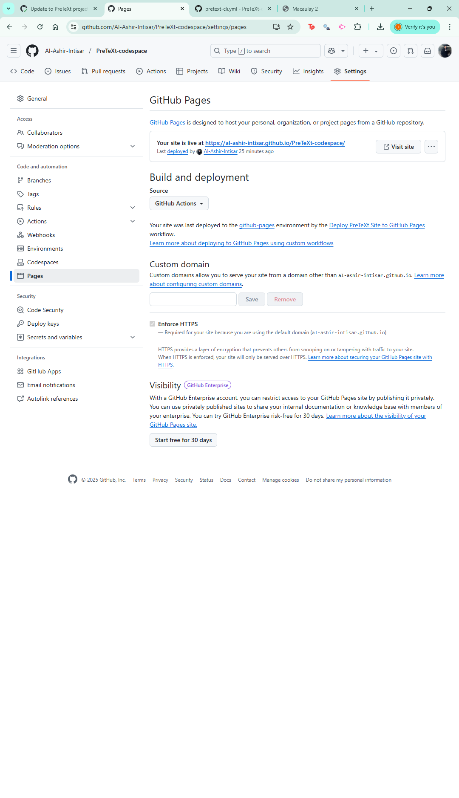

# PreTeXt-codespace
This repository is created to make getting started with PreTeXt as easy as spinning a codespace on this repository. 

reload window
kill terminal 
new terminal
then build 

set the Github pags build and deployment source to github actions as shown below

