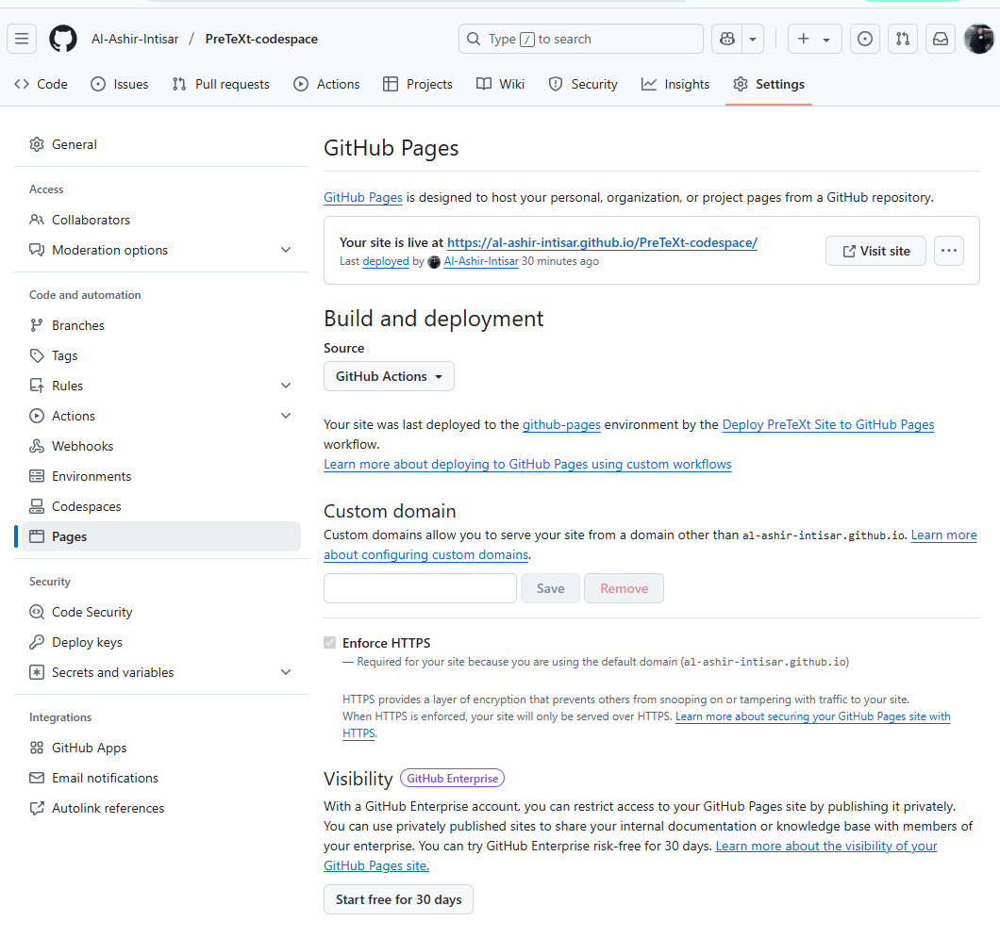
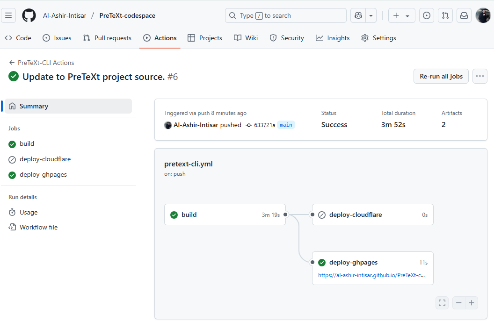

# PreTeXt Codespace

This repository is designed to help you quickly get started with [PreTeXt](https://pretextbook.org) by launching a GitHub Codespace. The following steps will guide you through building and deploying your PreTeXt project.

---

## 🚀 Quick Start Guide

1. **Reload the VS Code Window**
   - Press `Ctrl+Shift+P` → type `Reload Window` → hit Enter.

2. **Kill the Existing Terminal (if open)**
   - Click the trash icon in the terminal panel or run `Terminal: Kill Terminal` from the command palette.

3. **Open a New Terminal**
   - Press `Ctrl+Shift+\`` (backtick) or go to *Terminal → New Terminal*.

4. **Build the Project**
   - Run:
     ```bash
     pretext build web
     ```

5. **Preview with CodeChat**
   - Use [CodeChat](https://github.com/PreTeXtBook/pretext-cli/wiki/Live-preview-with-CodeChat) for live preview:
     ```bash
     codechat serve
     ```

6. **Deploy to GitHub Pages**
   - Run:
     ```bash
     pretext deploy --pages
     ```

---

## 🌐 GitHub Pages Configuration

Make sure to configure GitHub Pages to use **GitHub Actions** as the build and deployment source.

1. Go to your repository's **Settings** → **Pages**.
2. Under **Build and deployment**, set the source to **GitHub Actions** as shown below:



---

## ⏱ Deployment Time

Deployment takes about **4 minutes**. After triggering the deployment, wait a few minutes, then check your site via the GitHub Pages link.


